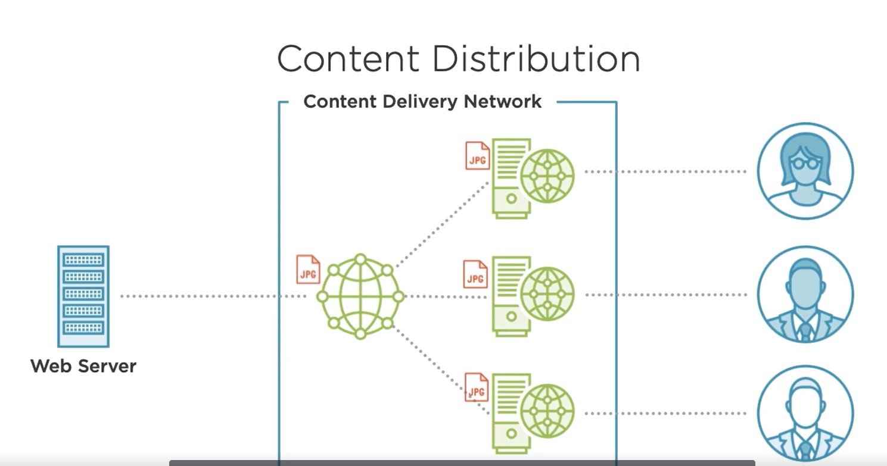
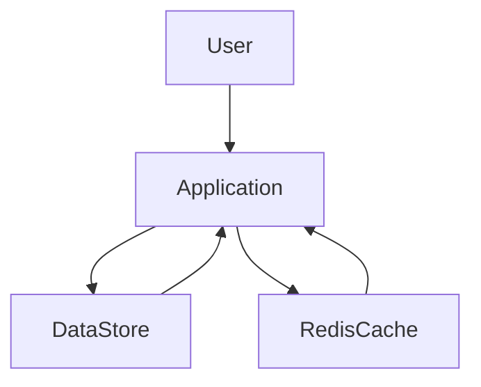

# Azure CDN Service
A content delivery network (CDN) is a distributed network of servers that can efficiently deliver web content to users.

A CDN Store cached content on edge server in point-of-presence (POP) locations that are close to end users


### Configuring Cache and Expiration Policies in Azure CDN

#### Create a new CDN Profile
- Name
- Resource Group
- Pricing Tier

#### Configure the CDN endpoint
- Name
- Origin type
- Origin hostname   (For resource outside Azure - custom origin with Url)
- Origin path
- Orighin host header

#### Navigate to endpoint url

### How Caching Works
CDN is a
- globally distributed network
- reduced asset load times
- reduced hosting bandwidth
- increased availability and redundancy 
- protection from denial-of-service attacks

#### Content Types
- Static Content (Images, CSS files, JS files)
- Dynamic Content (Changes on user interaction)

#### Understandign Azure CDN Caching


#### Request and Response Lifecycle
- If http headers doesn't specify the expiry, default of 7 days is used

#### Caching Rules
3 types of caching rule
- Azure CDN Standard (Verizon)
- Azure CDN Standard (Akamai)

Azure CDN (Microsoft)
- Standard rules engine

Azure CDN Premium (Verizon)
- Premium rules engine

#### Global Caching Rules
- Only one per endpoint
- Overrides cache headers

#### Custom Caching Rules
- One or many rules based on extension or path
- Overrides global rule

#### Query String
- Ignore query strings
- Bypass query strings (not cached at all)
- Cache every unique URL (may lead to less cache hit ratio)


# Azure Redis Cache

#### Azure Redis Cache Pricing Tiers
- Basic 
    - Minimal feature set
    - No SLA
    - Development and test

- Standard
    - 2 Replicated nodes
    - 99.9% availability
    - 53 GB of memory
    - 20,000 clients

- Premium
    - Redis cluster
    - Low latency
    - 99.95% availability
    - 49,000 clients

- Enterprise
    - Full Redis feature set 
    - 99.99% availability

- Enterprise Flash
    - Fast non-volatile storage

*<u>Note</u>:* Can scale up, but cannot scale down!, pricing tiers

#### Understanding Default Caching Behaviour
- Improve performance and scalability
- Move frequently accessed data closer

##### When should we Cache?
- Repeatedly accessed data
- Data source performance
- Data contention (multiple processes accessing data)
- Physical location

##### Managing Lifetime in Redis Cache
- No default expiration, Content exists until it's removed
- Must set TTL manually

###### Calculating Cache Duration
- Rate of Changes
    - Long expiry for static data
    - Short expiry for volatile data
- Risk of Outdated data
    - Lower TTL to match data change

#### Use Redis Cache in web application
- Store and retrieve data
- StackExchange Redis client

*Lazy Connection* 
* ConnectionMultiplexer
* IDatabase

```csharp

var lazyConnection = new Lazy<ConnectionMultiplexer>(()  => 
{
    var connection = ConnectionMultiplexer.Connect(connectionString);
});

IDatabase cache = lazyConnection.Value.GetDatabase();
var pingResult = cache.Execute("PING");  // Pong
var flushallResult = cache.Execute("FLUSHALL"); //OK

var key = "greeting";
var greeting = cache.StringGet(key); // 
var setResult = cache.StringSet(key, "Hello from Console"); // True
greeting = cache.StringGet(key);
cache.Execute("CLIENT", "LIST");
cache.StringSet("ExpiringMessage", "Hi, I expire", TimeSpan.FromSeconds(10));
lazyConnection.Value.Dispose();
```

#### Redis Cache Best Practices
- Watch out for data loss   (don't rely on key exists)
- Set expiry times on manage content lifetime
- Add jitter to spread database load   (Varying the expiration time)
- Avoid caching large objects
- Host Redis in the same region as your application

### Implementing Application Caching Patterns

##### Benefits of Caching
- Performance
- Scalability
- Resilience

#### Exploring common Caching Patterns

##### Cache-aside Pattern


1. Does the data exist in the cache?
2. If not, retrieve from the data store
3. Store a copy in the cache

##### Content Cache Pattern
- Cache Static Content
    - Images
    - Templates
    - Style sheets
- Reduces server load
- Redis Output Cache Provider for ASP.NET

##### User Session Caching Pattern
- Maintain application state
    - Shopping cart
- Session cookies or local storage
    - limited data storage
    - slow performance

##### Advanced Patterns
###### Job and Message Queueing
###### Distributed Transactions

### Configuring Redis Cache
#### Estimating Cache Size
- Number of concurrent cached objects
- Size of cached objects
- Number of cache requests
- Cache expiration policy

<u>*Cache Hit Ratio*</u> The number of cache requests that return a result.

* Redis Benchmark Utitily
```
Redis-benchmark -q -n 100000
```
Cannot run from the Azure Portal
Create a VM that contains the Redis CLI

### Creating resilient connections
### Defining custom retry policies


```csharp
var connectionString = "";
ConfigurationOptions options = ConfigurationOptions.Parse(connectionString);
// options.ReconnectRetryPolicy = new LinearRetry(5000);
// options.ReconnectRetryPolicy = new ExponentialRetry(5000);
options.ConnectTimeout = 15000;
var lazyConnection = new Lazy<ConnectionMultiPlexer>(() => 
    return ConnectionMultiPlexer.Connect(options);
);
```

### SSL Configuration
- Advanced Settings - Allow only SSL
- Minimum TLS Version - 1, 1.1, 1.2
*Performance over head to SSL Connection*

