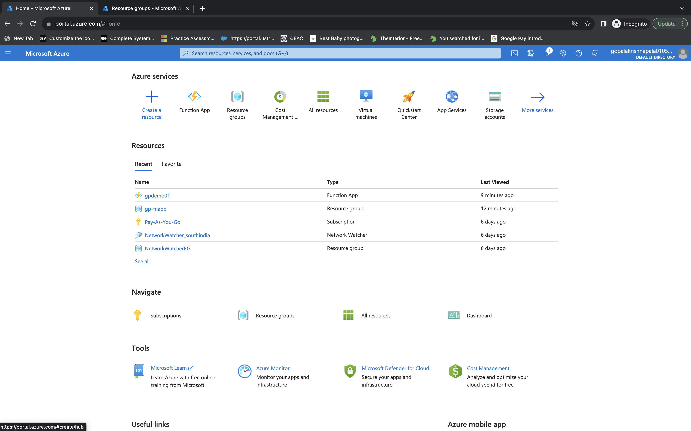

# Azure Function and GitHub Documentation

This document outlines the steps to create an Azure Function in Azure Portal.

## Step 1: Login to Azure Portal

1. Go to [Azure Portal](https://portal.azure.com/).
2. Sign in with your Azure account.

## Step 2: Create an Azure Function App

1. Click "+ Create a resource" and search for "Function App."
2. Fill in the required information and create the Function App.

## Step 3: Create an HTTP-based Function in Azure Portal

1. Inside the Function App, click "+ Add" to create a new function.
2. Choose "In-portal" as the development environment.
3. Select "Webhook + API" as the scenario.
4. Choose "HTTP trigger" as the template.
5. Provide a name, authentication level, and click "Create."

## Step 4: Test the Azure Function and Convert to Markdown (for GitHub)

1. Modify the function code to suit your needs.
2. Test the function to ensure it's working correctly.
3. Create a Markdown file using your preferred text editor/IDE.
4. Document the function creation process and include the modified code.

Remember to replace placeholders with actual details as needed.

