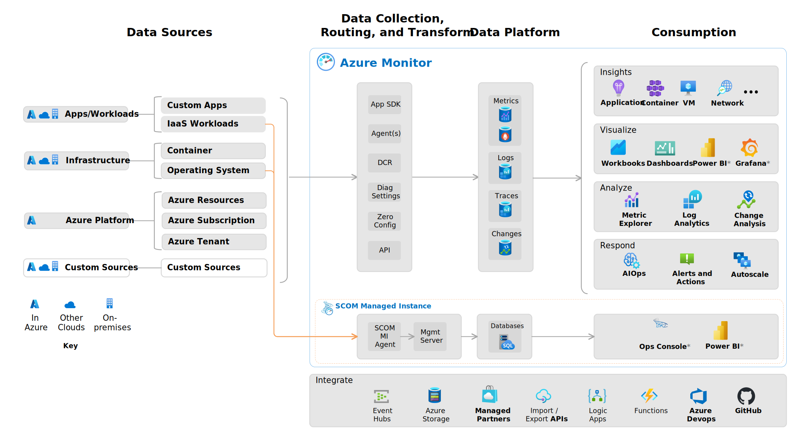

# Azure Monitor overview
Azure Monitor is a comprehensive monitoring solution for collecting, analyzing, and responding to monitoring data from cloud and on-premises environments.

The below image shows the high level architecture of Azure Monitor.

## Azure Monitor Service
### Setting up Alerts
- Setting Static Alerts
- Setting Dynamic thresholds
    Azure Monitor uses Machine learning to check the historical behavior of metrics.

    - Sensitivity
        - High
        - Medium
        - Low

## Log Analytics Workspace
- Central solution for all logs.
    - kusto query language
    - marketplace solutions

- Query using Powershell

