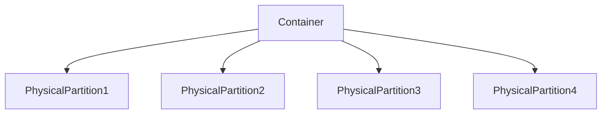

# Azure Cosmos DB

## Contents
- Concepts
    - Introduction
    - Throughput and Cost
    - Horizontal Partitioning
    - Global Distribution
- How to
    - Data Modeling and Migration
    - Querying with SQL
    - Programming with the .NET SDK
    - Advanced Programming Features
    - Management and Security
    - Using the Gremlin API

## Introduction
### NoSQL
- Relational databases are not designed for handling big data. Relational databases can scale up, but difficult to scale out.
- 3 V's of Big Data
    - **Volume** - terabytes, petabytes of data.
    - **Velocity** - defines the throughput
    - **Varity** - defines the schema
- **NoSQL** database is designed 
    - *Distributed* - Replicas ensure high availability and resilence
    - *Scale-out* - Horizontal partitioning for elastic storage and throughput
    - *Schema-free* - No enforced schema. No defined shape

### Cosmos DB
- **Massively scalalbe NoSQL database** i.e. fully managed Azure PaaS and has Single-digit millisecond reads and writes.
- **Automatic Horizontal Partitioning** which has elastic scale for both storage and throughput
- **Global distribution** with Point-and-click geo-replication and Multiple write region
- **Multi-model/Multi-API** which supports document database, table, graph, and columnar.
 
### Getting Started
- **30-day Free trail** - http://azure.microsoft.com/try/cosmosdb
- **Azure Portal** - Free Tire for the first Cosomos db in the subscription (upto $64/mo free)
- **Local Emulator** - http://aka.ms/cosmosdb-emulator

### Create a Cosmos DB
- Capacity 
    - Provisioned thorughput
    - Serverless

- Global Distribution

#### Creat Container
- Data Explorer

- Need to create multiple containers based on
    - Throughput - performance
    - Partition - How data is seggregated

- Analytics store

- Container
    - Items

    - Single partition query, cross partition query

- Management Options
    - Azure Portal
    - Azure CLI
    - PowerShell
    - ARM Templates
    - Notebooks
    - REST API

- Creating a simple Notebook

- Automatic Indexing
    - Indexed entries for querying

### Multiple APIs and Data Models
- SQL API
    - JSON Document
    - SQL queries

- MangoDB API
    - BSON Document
    - MangoDB queries
    - Standard DB Driver support

- Table API
    - Key-Value
    - Azure Table Storage

- Gremlin API
    - Graph
    - Vertices and Edges

- Cassandra API
    - Columnar
    - Schema

### Advantages
- Global Distribution
- Horizontal Partitioning
- Automatic Indexing
- Provisioned Throughput

- Atom Record Sequence (ARS)
    - It's all ARS under the cover, projected as any desired data model

## Throughput and Cost
- Measuring Performance
    - **Latency** - How fast is the response for a given request?  
    - **Throughput** - How many requests can be served within a specific period of time?

- Request Units
    - **Throughput Currency** - Blended measure of computational cose => % Memory + % CPU + % IOPs
    - **All Requests are not equal** - Every Cosmos DB response header show the RU charge for the request
    - **Request Units are Deterministic** - The same request will always require the same number of request units

- Monitoring Request Unit Consumption
    - Query Stats

- Throughput Offers
    | **Provisioned throughput (manual)** | **Provisioned throughput (autoscale)** | **Serverless**                     |
    | ----------------------------------- | -------------------------------------- | ---------------------------------- |
    | Reserve RU/sec                      | Reserve max RU/sec                     | Consumption model                  |
    | Guaranteed always available         | Scales up and down automatically       | No Provisioned throughput          |
    | Can lower and raise as needed       | From max to 10% below                  | Pay only for the RUs that you use  |
    | Better for predictable workload     | better for un predicatable workload    | Better for spiky workloads         |


- Provisioning Container Throughput
    - **Reserve request units per second (RU/s)** - How many request units are available for the application
    - **Exceeding reserved throughput limits** - Requests are *throttled* (HTTP 429)
        - x-ms-retry-after-ms (response header)

- Provisioning Database Throughput
    - Distribute the throughput across the containers
    - **Migrating existing applications** - May already be designed with separate containers per type
    - **Differentiate solely on Partition key** - Containers share throughput needs, but different partitioning requirements
    - **Mix and Match** - Distribute database throughput across some containers. Provision other containers individually

- Whiteboarding the Cost
    - Baseline
        | Read item | SQL Query | Write item |
        | --------- | --------- | ---------- |
        | RU        |  ~2.8 RUs | ~ 10 RUs   |

    - [Capacity Calculator](https://cosmos.azure.com/capacitycalculator)

    - Pricing
        - Storage 
            - Consumption-based SSD storage - $0.25 for 1 GB per month per region
        - Provisioned throughput 
            - Manual provisioned throughput - $0.008/hr for 100 RU/sec per region
            - Autoscale provisioned throughput - $0.012/hr for 100 RU/sec per region
        - Serverless
            - Consumption-based per request - $0.25 per 1 million RUs
        - More options
            - Reserved capacity, multi-master, analystic storage

### Horizontal Partitioning
- Achieving Elastic Scale
    - **What is Partioning?** - Massive scale-out within a container
    - **Containers** - Single logical resource composed of multiple pysical partitions
    - **Partitions** - Physical fixed-capacity data buckets
    - **Automated Scale-Out** - Cosmos DB transparently splits partitions to manage growth



- Understanding Logical Partitions
    - Partition key - defines the logical partition key
    - Every document has a maximum size of 2 MB
    - Every logical partition size has maximum of 20 GB

- Partition Splits
    - Cosomos DB maintains the physical partition,
    - It decides which physical partition every logical partition going to be hosted on.
    - Partition splits happen instantaneous

- Avoiding Hot Partitions
    - Avoid selecting partition key where some are large partitions and other are small partitions
    - Select uniform distribution of logical partitions

- Cross-partition Queries
    - querying across all the partitions

- Choosing the Right Partition Key
    - Based on common usage patterns - The right choice will deliver massive scale
    - Avoid performance bottlenecks - Ensure uniform distribution of both storage and throughput
    - Boundary for queries and transactions - Minimize cross-partition queries, stored procecures with ACID guarantees

- Common Partitioning Patterns
    - /id  - single-documents
        - each document in logical partition ==> good for high write intensive scenario
    
    - /type - small lookup list
    - Other - Optimize for queries

- Changing the Partition Key
    - Partition keys are immutable 
        - Can't change for the container
        - Can't change for the document
    - Always use the same property path
        - For example: /pk , store a copy of the desired partition key
    - Always uniquely qualify the id property
        - can be a GUID, but doesn't have to be

- Partition Granularity
    - Synthetic Partition Keys
        - Iot: Device ID
        - Multitenant: Tenant ID
        - Device ID + Month
        - Tenant ID + User ID
    
    - Hierarchical Partition Keys
        - Aka "subpartitioning" upto 3 levels
        - Leaf level limit = 20 GB
        - Parent level limit > 20 GB
    
- Hierarchical Partition Keys
    - Synthetic partition key : Tenant ID + User ID
    - SELECT * FROM c WHERE c.tenantId = 'TenantX' <-- Cross-partition query
    - Hierarchical partition key: Tenant ID / User ID
        - SELECT * FROM c WHERE c.tenantId = 'TenantX' <-- Sub-partition query
        - SELECT * FROM c WHERE c.tenantId = 'TenantX' <-- Single-partition query

### Global Distribution
- Replication
    - Performance
    - Business continuity
        - Replica failover within a region

- Enabling Global Distribution
    - Associate multiple regions with your Cosmos DB account
        - Limited to geo-fencing policies
    - Dynamically add and remove regions
        - Associate (and disassociate regions) with the click of a mouse
    - Multi-master
        - Enable writes across all regions, with automatic failover

- Global Distribution
    - Replicate data globally
    - Enable Mult-region writes
    ```csharp
        var options = new CosmosClientOptions
        {
            ApplicationRegion = "West US"
        };
    ```
    - Doesn't impact the throuput, but greatly effects the latency
    - Rights charges will increase - increased RU

- Mult-master Conflict Resolution
    - Every region is enabled for writes, inviting conflicts
    - There options for conflict resolution
        - **Last writer winds** - Based on highest timestamp value in _ts
            - Data Explorer - Scale and Settings
        - **Custom procedure** - Based on stored procedure result
        - **Conflices feed** - review the conflicts in data explorer

- Replication and Consistency
    - Replication within a region
        - Multiple replicas invite "dirty reads"
        - Extremely rare, since replicas are updated extermely fast
    
    - Global replication
        - It takes hundreds of milliseconds to move data across continents
        - Much more common to experience dirty reads

### Consistency Levels
    - Strong
    - Bounded Staleness
    - Session
    - Consistent Prefix
    - Eventual

| Strong | Bounded Staleness | Session | Consistent Prefix | Eventual |
| ------ | ----------------- | ------- | ----------------- | -------- |
| <ul> <li> No dirty reads </li> <li> Highest write latency </li> <li> Consistent reads at low latency </li> <li> Reads from quorum </li> <li> Can combine with global | Dirty reads possible </li> <li> Configurable staleness </li> <li> Bounded by time and updates </li> <li> Reads from quorum </li> </ul> |  <ul> <li> Default level </li> <li> No dirty reads for writers (reads your own data) </li> <li> Dirty reads possible for other users </li> <li> Usually reads from single replica </li> <ul> | <ul> <li> Reads from single replica </li> <li> Dirty reads possible </li> <li> Quorum is already updated </li> <li> Reads never see out-of-order writes </li> </ul> | <ul> <li> No guarantees </li> <li> Lowest write latency </li> <li> Best performance </li> <li> Reads from single replica </li> <li> Dirty reads possible in any order </li> </ul> |

- Setting the consistency Level
    - Set defautl for entire account
    - Override at the request level - any request can weaken the default consistency level
    ```csharp
        new ItemRequestOptions 
        { 
            ConsistencyLevel = ConsistencyLevel.Session
        }
    ```

## Data Modeling and Migration
- Document database
    - JSON documents
        - Non-relational
        - No Joins
        - No relational constraints
    
    - Paradigm shift
        - Need to use different techniques to implement relations between entities
    
    - New approach
        - Most intutions and best practices don't translate well in the NoSQL world

- Relational vs. Document
| Relational Database    | Document database |
| ---------------------- | ----------------- |
| Rows                   | Documents         |
| Columns                | Properties        |
| Strongly types schemas | No defined schema |

- Denormalizing the Model

- Data Migration Options
    - Data Migration Tool
        - Open source desktop application, suitable for small-to-medium datasets
    
    - Azure Data Factory
        - ETL service for data integration, suitable for medium-to-large datasets

    - Spark Connector
        - Big data analytics using Apache Spark
    
    - Custom Tool
        - Support extremely large (100 TB+) datasets
    
    - Online migrations
        - Change feed
        - Striim
    
    - Stream Analytics
        - Aggregate, analyze, and transform fast streaming data
    
    - Apache Kafka Connector
        - Import and export Kafka topics

- Special Document Properties
    - id - User-defined unique ID
    - _rid - Resource Id
    - _self - Full path to document
    - _etag - Binary value, that changes when the resource changes
    - _attachments - URI suffix to the attachments
    - _ts - Last updated timestamp (epoch)
    - ttl - expiration in seconds
        - Eanble Time to Live at container level

## Querying Query with SQL
- Cosmos DB SQL
    - Special version of SQL designed for JSON
    - Works with documents and JSON data types

- Familiar keywords
    - SELECT, FROM, WHERE, JOIN, IN, BETWEEN, ORDER BY
    
- Work with JSON
    - Descend into any subsection of a document
    - Iterate nested arrays for intra-document join
    - Return documents as-is, or as custom shape

- Example
    ```sql
    SELECT ch.name, ch.birthdate
    FROM Families AS f
    JOIN ch IN f.children
    WHERE f.address.state = 'CA'
    ```

- Common operators
    - String ->  || (concatenate)
    - Ternary & coalesce -> ? : ??
    
- Build - in functions
    - Simple Query
        ```sql
        SELECT * FROM c  /* Get all the documents from the container */
        -- If using specific properties instead of *, then it will e a projection
        ```
- Scalar Expression Queries
    ```sql
    SELECT "Hello"
    SELECT "Hello" as Word
    SELECT VALUE "Hello"

    SELECT GETCURRENTDATETIME()
    SELECT GETTIMESTAMP()
    ```

    ```json
    [
        {
            "$1": "Hello"
        }
    ]
    ```

- Querying a Container

    ```sql
    SELECT * FROM c
    SELECT c.location.city, c.location.state
    FROM c      -- Just an alias for the container
    ```

    ```sql
    SELECT * FROM c.children    -- just the children propery
    ```

    ```sql
    -- FROM with IN
    -- Use IN to break each item into multiple documents on a child array
    SELECT * FROM ch IN c.children
    ```

- Intra-document Joins
    ```sql
    -- Use Join to perform an "intra-document" join between a parent object and child array
    -- This works similar to IN, but also keeps parent properties in scope similar to an INNER JOIN in regular SQL.
    ```

- Projections
    ```sql
    SELECT
        c.address.courntry AS Country,
        {
            "storename": c.name,
            "cityStateZip": [
                c.address.location.city,
                c.address.location.stateProvinceName
            ]
        }
    FROM c
    ```
- Range Queries
    ```sql
    WHERE c.name BETWEEN 'A' AND 'K'
    ORDER BY c.name

    TOP 10
    OFFSET 10 LIMIT 10;
    ```

- Subset filtering
    ```sql

    ```

- Calculated Properties
- Aggregation queries


    


    

    


